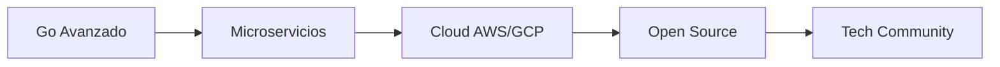

<div align="center">


[](mailto:santiago11ro11@gmail.com)
[](https://wa.me/573218609098)

</div>

---

## 👨‍💻 Sobre Mí


Soy un desarrollador apasionado por construir **soluciones escalables y eficientes**. 

Actualmente enfocado en **desarrollo Backend** con Go y PHP, aplicando arquitectura por capas y buenas prácticas de diseño de software.

```yaml
nombre: Kevin Santiago Rodríguez Rojas
ubicación: Colombia 🇨🇴
rol: Backend Developer & Software Engineering Student
enfoque:
  - Go
  - PHP
  - APIs RESTful
  - Clean Architecture
intereses:
  - AI/ML
  - Data Science
  - System Design
```

<br clear="right"/>

---

## 🏆 Certificaciones

<div align="center">

| Certificación | Área | Certificación | Área |
|:-------------:|:----:|:-------------:|:----:|
| 🌐 | **Front-End Development** | 🔢 | **Estructuras de Datos para IA** |
| 🏗️ | **Patrones de Diseño** | 🧱 | **Arquitectura de Software** |

</div>

---

## 💻 Stack Tecnológico

### Backend & Databases
<p>
  
  
  
  
</p>

### Frontend
<p>
  
  
  
  
  
</p>

### Herramientas & Otros
<p>
  
  
  
  
</p>

---

## 🔥 Proyectos en Desarrollo

<table>
<tr>
<td width="50%" valign="top">

### 🎨 Sistema de Gestión de Campañas Publicitarias
**🚧 En desarrollo activo**

Backend en **Go** con arquitectura modular

**Funcionalidades en progreso:**
- 🔄 APIs RESTful
- 🔄 Autenticación JWT
- 🔄 CRUD completo
- 🔄 Integración con IA para generación de imágenes


</td>
<td width="50%" valign="top">

### 🛒 Sistema E-commerce
**🚧 En desarrollo**

Plataforma completa de comercio electrónico

**Características planeadas:**
- 🔄 Carrito de compras
- 🔄 Sistema de pagos
- 🔄 Panel de administración
- 🔄 Diseño responsive


</td>
</tr>
</table>

> 💡 **Nota:** Estos proyectos están en desarrollo activo. ¡Próximamente más actualizaciones!

---

## 📊 Estadísticas de GitHub

<div align="center">
  
  
</div>

<div align="center">
  
</div>

---

## 🎯 En qué estoy trabajando

<table>
<tr>
<td valign="top" width="50%">

#### 📚 Aprendiendo
- Microservicios
- Docker & Kubernetes
- gRPC
- System Design

</td>
<td valign="top" width="50%">

#### 🔨 Construyendo
- API de generación de contenido con IA
- Sistema de autenticación avanzado
- Arquitectura hexagonal

</td>
</tr>
<tr>
<td valign="top" width="50%">

#### 🔍 Explorando
- Machine Learning
- Deep Learning
- Computer Vision
- NLP

</td>
<td valign="top" width="50%">

#### 📈 Mejorando
- Patrones de diseño
- Clean Architecture
- Testing & TDD
- Performance optimization

</td>
</tr>
</table>

---

## 🤖 Mi Visión con IA

<div align="center">

> ### *"La Inteligencia Artificial no es solo el futuro, es el presente que estoy construyendo"*

</div>

Me apasiona explorar cómo la IA puede transformar aplicaciones cotidianas en soluciones inteligentes.

**Mi objetivo es especializarme en:**

<div align="center">

| 🧠 | 📊 | 🤖 | 🎯 | 💡 |
|:---:|:---:|:---:|:---:|:---:|
| **Machine Learning** | **Big Data** | **Sistemas Inteligentes** | **MLOps** | **IA Aplicada** |
| Deep Learning | Análisis Predictivo | Integración de IA | Despliegue de Modelos | Problemas Reales |

</div>

---

## 💡 Mi Filosofía

<div align="center">

### 🚀 *"No lo sé todo, pero aprendo rápido"*

<table>
<tr>
<td align="center" width="25%">
  
### ⚡
**Aprendo rápido**

Nuevas tecnologías no son problema

</td>
<td align="center" width="25%">
  
### 🔄
**Me adapto**

Cualquier stack tecnológico

</td>
<td align="center" width="25%">
  
### 🔬
**Experimento**

Investigo y mejoro constantemente

</td>
<td align="center" width="25%">
  
### 💼
**Aplico**

Lo aprendido en proyectos reales

</td>
</tr>
</table>

---

### *"La disciplina y la consistencia construyen desarrolladores excepcionales"*

</div>

---

## 🎓 Objetivo Profesional

<div align="center">

**Convertirme en un Senior Backend Developer especializado en arquitectura de sistemas y soluciones con IA**

*Contribuyendo a proyectos que impacten positivamente a miles de usuarios*

</div>

### 📍 Mi Roadmap 2025



- [ ] 🎯 Dominar Go a nivel avanzado
- [ ] 🏗️ Implementar arquitectura de microservicios
- [ ] ☁️ Certificación en Cloud (AWS/GCP)
- [ ] 🌟 Desarrollar proyectos Open Source
- [ ] 🤝 Contribuir a la comunidad tech

---

## 📫 Conecta Conmigo

<div align="center">

[](mailto:santiago11ro11@gmail.com)
[](https://wa.me/573218609098)

</div>

---

## ⚡ Fun Fact

<div align="center">

**Mi ciclo de aprendizaje:**

🎯 Aprender → 💻 Practicar → 📈 Mejorar → 🔁 Repetir


</div>

---

<div align="center">


</div>
